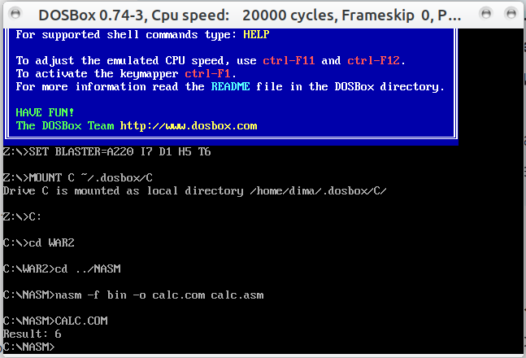

# goit-cs-hw-01

## task01

```
nasm -f bin -o calc.com calc.asm
```



## task02

### run tests

```
python3 test_lex01.py
Test passed for '3 + 5': 8
Test passed for '10 - 2': 8
Test passed for '4 * 7': 28
Test passed for '20 / 4': 5.0
Test passed for '3 + 4 * 5': 23
Test passed for '10 - 2 + 3': 11
Test passed for '5 * 2 - 3': 7
Test passed for '(3 + 5) * 2': 16
Test passed for '10 - (2 + 3)': 5
Test passed for '4 * (7 - 3)': 16
Test passed for '(8 / 2) + (3 * 5)': 19.0
Test passed for '((2 + 3) * (4 - 1))': 15
Test passed for '(3 + (2 * 2)) - (5 / 5)': 6.0
Test passed for '3 + (4 * (5 - 2))': 15
Test passed for '(10 / (2 + 3)) * 4': 8.0
Test passed for '((2 * 3) + (5 - 1)) / 2': 5.0
Test passed for '(6 * 3) / 2': 9.0
Test passed for '18 / (2 * 3)': 3.0

```

### interactive mode

```
python3 lex01.py

Введіть вираз (або "exit" для виходу): (2 + 3) * 4
20
Введіть вираз (або "exit" для виходу): ((2 * 3) + (5 - 1)) / 2
5.0
Введіть вираз (або "exit" для виходу): 5 / (5 - 5)
division by zero
Введіть вираз (або "exit" для виходу): ((10 / 2) + 3) * (4 - 1)
24.0
Введіть вираз (або "exit" для виходу): (3 * (2 + (1 * (4 - 2)))) + (6 / (3 - 1))
15.0
Введіть вираз (або "exit" для виходу): ((8 / 2) + (3 * (2 + 2))) - (4 * (3 - 1))
8.0
Введіть вираз (або "exit" для виходу): (3 + 2 - 6
Помилка синтаксичного аналізу
Введіть вираз (або "exit" для виходу): ((3 + 2) - 6))
-1
Введіть вираз (або "exit" для виходу): ((50 - (10 + 5)) / 5) + ((6 * 2) - (3 + 1))
15.0
Введіть вираз (або "exit" для виходу): exit
Вихід із програми.
```
